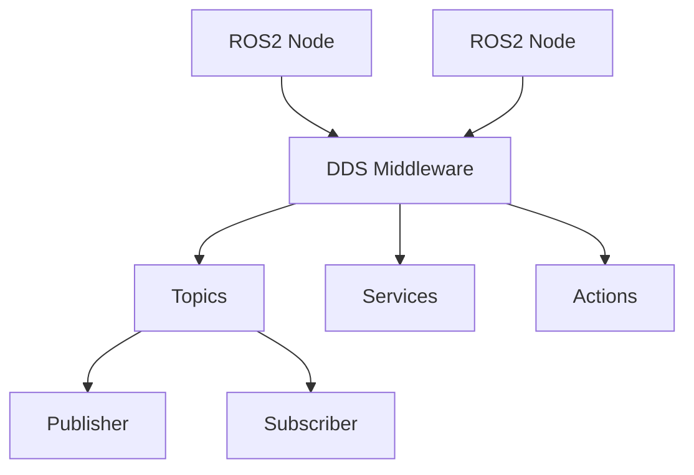
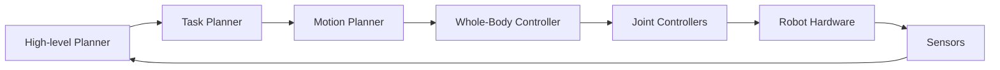
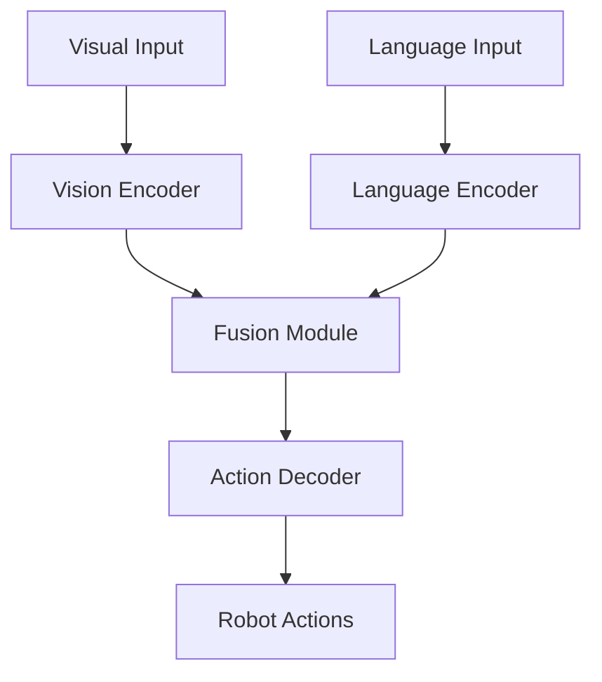

# Mermaid Diagram Examples

This file demonstrates how to include Mermaid diagrams in the book for illustrating architectural concepts.

## ROS2 Architecture Diagram

## Humanoid Robot Control Architecture

## VLA System Architecture

These diagrams can be embedded directly in the documentation to illustrate complex concepts and system architectures.